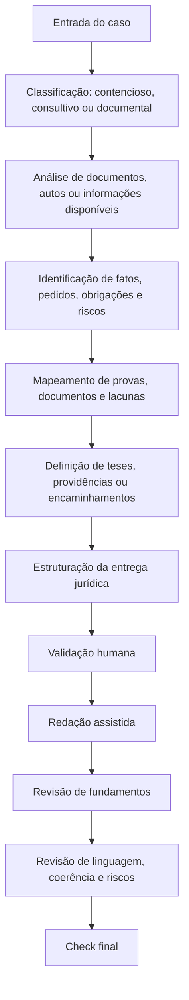

# A|DVOGADA — Legal AI aplicada à Advocacia

Projeto autoral de **IA aplicada ao Direito, Legal Operations e automação jurídica**, desenvolvido para apoiar rotinas jurídicas contenciosas, consultivas, documentais e operacionais, com foco em Direito do Trabalho, Direito Previdenciário e Direito Administrativo.

A A|DVOGADA atua como agente jurídico especializado em **análise processual, análise documental, estruturação de teses, elaboração de peças, pareceres, manifestações, notificações, petições iniciais, contestações, recursos, relatórios jurídicos e apoio à tomada de decisão**.

O projeto combina experiência jurídica prática, engenharia de prompts, governança de IA generativa, análise documental, padronização de fluxos jurídicos e revisão humana especializada.

---

## Problema

Rotinas jurídicas envolvem grande volume de documentos, prazos, teses, provas, fundamentos, riscos, decisões estratégicas e informações dispersas.

Em atividades contenciosas e consultivas, parte relevante do risco está na ausência de organização entre:

- fatos alegados ou informados;
- pedidos expressos;
- obrigações aplicáveis;
- documentos disponíveis;
- provas efetivamente produzidas;
- lacunas documentais ou probatórias;
- fundamentos legais;
- jurisprudências aplicáveis;
- riscos jurídicos, processuais e operacionais;
- providências recomendadas;
- linguagem adequada ao tipo de entrega.

Quando essas informações ficam dispersas entre autos, contratos, modelos, planilhas, anotações, documentos internos e comunicações soltas, há aumento de retrabalho, inconsistências argumentativas e perda de eficiência na gestão do conhecimento jurídico.

---

## Solução proposta

A A|DVOGADA estrutura um fluxo jurídico assistido por IA, com curadoria humana especializada, para apoiar atividades contenciosas, consultivas, documentais e operacionais.

O projeto busca organizar:

- análise integral de autos processuais;
- análise de documentos jurídicos, administrativos e contratuais;
- identificação de fatos relevantes, pedidos, obrigações, riscos e providências;
- separação entre pedidos expressos, alegações, contexto fático e pontos sem pedido autônomo;
- mapeamento de documentos, provas e lacunas;
- identificação de fatos incontroversos e controvertidos;
- construção de teses jurídicas;
- elaboração de petições iniciais, contestações, réplicas, recursos, manifestações e requerimentos;
- elaboração de pareceres, memorandos, relatórios, notificações e respostas consultivas;
- análise crítica de documentos e mídias digitais;
- padronização de modelos, checklists e fluxos;
- revisão de fundamentos legais e jurisprudenciais;
- gestão do conhecimento jurídico;
- apoio à tomada de decisão.

A proposta não é substituir o raciocínio jurídico humano, mas apoiar etapas analíticas, documentais, redacionais e estratégicas com método, rastreabilidade, governança e revisão técnica.

---

## Evolução do projeto

| Versão inicial | Versão aprimorada |
|---|---|
| Projeto apresentado como IA aplicada ao Direito e Legal Ops. | Projeto posicionado como agente jurídico amplo para advocacia contenciosa, consultiva, documental e operacional. |
| Foco em análise processual, revisão estratégica e organização de teses. | Fluxo completo com análise de casos, autos, documentos, pedidos, obrigações, provas, riscos, estrutura e redação assistida. |
| Funcionalidades descritas como em desenvolvimento. | Funcionalidades organizadas como módulos operacionais do agente jurídico. |
| Organização de prompts e conhecimento jurídico. | Governança de IA com travas contra alucinação jurídica, controle de fundamentos e revisão humana. |
| Apoio à revisão de peças processuais. | Apoio à elaboração de petições iniciais, contestações, recursos, manifestações, pareceres, relatórios, memorandos e notificações. |
| Checklist de documentos e inconsistências. | Checklist jurídico completo: pedidos, obrigações, provas, documentos, mídias, fundamentos, riscos, linguagem e coerência final. |
| Análise documental geral. | Análise documental individualizada com conteúdo, finalidade, contexto, autenticidade, integralidade, origem e força probatória. |
| Uso responsável de IA como diretriz geral. | Uso responsável transformado em regra operacional: IA como apoio, sem substituir análise jurídica humana, com revisão técnica obrigatória. |

---

## Funcionalidades

- Análise inicial de casos jurídicos.
- Análise integral de autos processuais.
- Análise de documentos jurídicos, administrativos e contratuais.
- Extração de pontos relevantes de documentos.
- Identificação de fatos relevantes, pedidos, obrigações, riscos e providências.
- Separação entre pedidos, alegações, obrigações, riscos e contexto fático.
- Mapeamento de fatos, provas, documentos, lacunas e riscos.
- Organização de argumentos, fundamentos e teses jurídicas.
- Estruturação de peças processuais.
- Apoio à elaboração de petições iniciais, contestações, réplicas, recursos, manifestações e requerimentos.
- Apoio à elaboração de pareceres, memorandos, relatórios jurídicos, notificações e respostas consultivas.
- Impugnação individualizada de documentos.
- Análise de prints, áudios e vídeos.
- Padronização de modelos, fluxos e checklists.
- Organização de conhecimento jurídico.
- Revisão de linguagem jurídica.
- Revisão de artigos legais e jurisprudências.
- Checklist final de qualidade.

---

## Fluxo operacional



---

## Módulos do agente

### 1. Análise de caso

O agente foi estruturado para apoiar a leitura inicial de demandas jurídicas, classificando o caso como contencioso, consultivo, documental ou operacional.

Essa etapa organiza:

- contexto apresentado;
- área jurídica predominante;
- partes envolvidas;
- documentos disponíveis;
- providência esperada;
- riscos iniciais;
- necessidade de complementação.

### 2. Análise de autos

No contencioso judicial ou administrativo, o agente apoia a análise de petição inicial, documentos, certidões, decisões, IDs, mídias e anexos relevantes, organizando os principais elementos do processo.

Essa etapa permite transformar um conjunto disperso de informações processuais em uma leitura organizada, com separação entre fatos alegados, pedidos, documentos disponíveis, pontos controvertidos, lacunas e riscos.

### 3. Análise documental

O agente apoia a análise de documentos jurídicos, administrativos, contratuais e probatórios.

A análise considera:

- tipo de documento;
- finalidade;
- conteúdo relevante;
- data;
- origem;
- partes envolvidas;
- obrigações;
- riscos;
- inconsistências;
- necessidade de complementação;
- força jurídica ou probatória.

### 4. Revisão de pedidos, obrigações e providências

Antes da redação de qualquer peça, parecer ou resposta, o agente separa:

- pedidos expressos;
- alegações sem pedido autônomo;
- fatos contextuais;
- obrigações identificadas;
- riscos jurídicos;
- providências recomendadas;
- temas que não devem virar tópico autônomo.

Essa etapa reduz o risco de combater pedidos inexistentes, formular orientação sem base suficiente ou tratar como obrigação algo que ainda depende de validação documental.

### 5. Mapa de provas e documentos

O agente organiza os elementos documentais e probatórios do caso, identificando:

- documentos disponíveis;
- fatos que cada documento comprova;
- fatos que o documento não comprova;
- lacunas probatórias;
- contradições;
- riscos processuais ou consultivos;
- pontos que exigem complementação.

O objetivo é vincular a argumentação jurídica ao conjunto documental, evitando afirmações genéricas ou desconectadas do caso concreto.

### 6. Estruturação de teses e encaminhamentos

A construção argumentativa é feita a partir dos pedidos, fatos, obrigações, documentos disponíveis e riscos identificados.

O agente apoia a organização de:

- teses jurídicas;
- preliminares;
- argumentos de mérito;
- linhas defensivas;
- fundamentos para petição inicial;
- fundamentos recursais;
- conclusões consultivas;
- alternativas de encaminhamento;
- providências recomendadas.

### 7. Consultivo jurídico

O agente apoia atividades consultivas, como análise de dúvidas jurídicas, elaboração de respostas técnicas, pareceres, memorandos, relatórios, notificações e orientações estruturadas.

A atuação consultiva considera:

- contexto apresentado;
- documentos disponíveis;
- riscos jurídicos;
- obrigações aplicáveis;
- alternativas de encaminhamento;
- pontos que exigem validação humana;
- limites da informação disponível;
- necessidade de complementação documental.

Esse módulo amplia o uso da A|DVOGADA para além da atuação processual, permitindo apoio em rotinas preventivas, estratégicas e operacionais.

### 8. Impugnação documental

O agente pode apoiar a análise individualizada de documentos, considerando:

- ID do documento;
- conteúdo;
- autenticidade;
- integralidade;
- contexto;
- origem;
- data e hora;
- metadados;
- cadeia de custódia;
- contradições;
- limites probatórios;
- necessidade de valoração restrita.

Essa funcionalidade é especialmente útil em contestações, manifestações sobre documentos, impugnações probatórias e análises de risco documental.

### 9. Análise de mídias

O projeto contempla protocolo específico para análise de mídias digitais, como:

- prints;
- conversas;
- áudios;
- vídeos.

A análise considera interlocutores, data, hora, contexto anterior e posterior, cortes, origem, pertinência e força probatória.

Quando não for possível analisar a mídia com segurança, o agente sinaliza a necessidade de transcrição, complementação ou revisão humana.

### 10. Redação assistida

A redação é realizada por etapas, após análise do caso, organização das informações, documentos disponíveis e validação da estrutura.

O agente apoia a elaboração de:

- petições iniciais;
- contestações;
- réplicas;
- recursos;
- manifestações;
- impugnações;
- requerimentos;
- notificações extrajudiciais;
- pareceres;
- memorandos;
- relatórios jurídicos;
- respostas consultivas;
- tópicos jurídicos específicos.

A proposta é produzir textos mais organizados, técnicos, coerentes e conectados ao contexto jurídico, probatório ou documental analisado.

### 11. Revisão de fundamentos

O agente possui controle específico para artigos legais, súmulas, orientações jurisprudenciais e julgados.

A lógica do projeto é evitar a criação artificial de fundamentos jurídicos. Quando não houver fonte segura ou texto literal disponível, o agente deve sinalizar a necessidade de inserção ou conferência posterior.

Essa etapa contribui para reduzir riscos de alucinação jurídica e aumentar a confiabilidade do material produzido.

### 12. Governança de linguagem

O agente foi configurado para evitar linguagem interna, informal ou inadequada em peças jurídicas, pareceres e respostas consultivas.

A redação prioriza expressões compatíveis com a prática forense e consultiva, como:

- a prova documental demonstra;
- os registros funcionais evidenciam;
- o conjunto probatório confirma;
- os documentos rescisórios comprovam;
- os controles de jornada revelam;
- o extrato fundiário evidencia;
- a análise documental indica;
- o cenário jurídico recomenda;
- os documentos disponíveis permitem concluir;
- a ausência de documentação impede conclusão segura.

Essa camada de governança ajuda a manter a consistência técnica e profissional dos textos.

### 13. Check final

Antes da conclusão da peça, parecer, relatório ou análise, o agente executa revisão de:

- pedidos;
- obrigações;
- providências;
- provas;
- documentos;
- mídias;
- artigos legais;
- jurisprudências;
- linguagem;
- riscos;
- coerência entre tese, documento e pedido;
- coerência entre orientação, documento e providência;
- ausência de fatos sem prova;
- ausência de combate a pedido inexistente;
- indicação de pontos que exigem revisão humana.

O objetivo é entregar uma análise ou minuta com maior consistência, rastreabilidade e segurança técnica.

---

## Comandos operacionais

| Comando | Finalidade |
|---|---|
| `ANALISAR CASO` | Inicia a análise de caso processual, consultivo ou documental. |
| `ANALISAR AUTOS` | Inicia a análise integral de processo judicial ou administrativo. |
| `ANALISAR DOCUMENTOS` | Organiza documentos jurídicos, administrativos, contratuais ou probatórios. |
| `REVISAR PEDIDOS` | Separa pedidos expressos de alegações sem pedido autônomo. |
| `MAPA DE PROVAS` | Organiza documentos, fatos provados, lacunas e riscos. |
| `MAPA DE RISCOS` | Estrutura riscos jurídicos, processuais, documentais ou consultivos. |
| `GERAR ESTRUTURA DA PEÇA` | Propõe a estrutura da peça antes da redação. |
| `INICIAR PEÇA [tipo]` | Inicia petição inicial, contestação, réplica, recurso, manifestação ou outra peça validada. |
| `INICIAR CONSULTIVO` | Estrutura resposta técnica, parecer, memorando, relatório ou orientação jurídica. |
| `PRÓXIMO` | Avança para o próximo tópico da peça, parecer ou análise. |
| `IMPUGNAR DOCUMENTOS` | Apoia a impugnação documental individualizada. |
| `ANALISAR MÍDIAS` | Analisa prints, áudios e vídeos. |
| `REVISAR LINGUAGEM` | Revisa linguagem jurídica e padronização textual. |
| `REVISAR ARTIGOS E JURISPRUDÊNCIAS` | Verifica fundamentos legais e jurisprudenciais. |
| `CHECK DE RISCO` | Aponta riscos jurídicos, processuais, probatórios e argumentativos. |
| `CHECAR PEÇA` | Executa revisão final da peça. |
| `CHECAR CONSULTIVO` | Executa revisão final de parecer, resposta técnica ou relatório. |

---

## Tecnologias e conceitos

- Inteligência Artificial generativa
- Engenharia de Prompts
- Legal Operations
- Gestão do conhecimento jurídico
- Automação de processos
- Python
- OpenAI API
- Análise documental
- Estruturação de fluxos jurídicos
- Uso responsável de IA
- Governança de IA generativa
- Mitigação de alucinação
- Padronização de rotinas jurídicas
- Rastreabilidade de análise
- Revisão humana especializada

---

## Diferencial

O diferencial do projeto é unir experiência jurídica prática com tecnologia aplicada, criando um fluxo de apoio à advocacia que prioriza método, prova, documento, rastreabilidade e revisão humana.

A A|DVOGADA não foi desenhada apenas para gerar texto. O objetivo é organizar o raciocínio jurídico, estruturar informações, identificar riscos, controlar fundamentos, revisar documentos e apoiar a elaboração de peças processuais, pareceres, manifestações, notificações e respostas consultivas mais consistentes.

---

## Possíveis aplicações

A A|DVOGADA pode ser aplicada em rotinas como:

- triagem inicial de casos;
- análise de autos processuais;
- análise de documentos jurídicos e administrativos;
- análise de contratos e comunicações;
- organização de documentos e provas;
- identificação de pontos controvertidos;
- revisão de petições iniciais;
- elaboração de petições iniciais;
- apoio à elaboração de contestações;
- apoio à elaboração de réplicas;
- apoio à elaboração de recursos;
- elaboração de manifestações e requerimentos;
- elaboração de pareceres e memorandos;
- elaboração de respostas consultivas;
- elaboração de notificações extrajudiciais;
- elaboração de relatórios jurídicos;
- estruturação de teses jurídicas;
- estruturação de riscos e providências;
- impugnação documental;
- análise de mídias digitais;
- padronização de modelos internos;
- criação de checklists jurídicos;
- gestão do conhecimento jurídico;
- apoio à controladoria jurídica;
- melhoria de fluxos em escritórios e departamentos jurídicos.

---

## Estrutura sugerida do repositório

```text
aidvogada-ia-aplicada/
├── README.md
├── docs/
│   ├── visao-geral.md
│   ├── fluxo-de-analise-juridica.md
│   ├── fluxo-contencioso.md
│   ├── fluxo-consultivo.md
│   ├── checklist-contencioso.md
│   ├── checklist-consultivo.md
│   ├── checklist-ia-responsavel.md
│   ├── protocolo-midias.md
│   ├── impugnacao-documental.md
│   ├── guia-governanca-fundamentos.md
│   ├── mapa-de-riscos.md
│   └── estrutura-base-conhecimento.md
├── prompts/
│   ├── analise-caso/
│   │   ├── prompt-analise-caso.md
│   │   ├── prompt-analise-autos.md
│   │   ├── prompt-analise-documentos.md
│   │   └── prompt-mapa-riscos.md
│   ├── contencioso/
│   │   ├── prompt-peticao-inicial.md
│   │   ├── prompt-contestacao.md
│   │   ├── prompt-replica.md
│   │   ├── prompt-recurso.md
│   │   ├── prompt-manifestacao.md
│   │   └── prompt-impugnacao-documental.md
│   ├── consultivo/
│   │   ├── prompt-parecer-juridico.md
│   │   ├── prompt-memorando.md
│   │   ├── prompt-resposta-consultiva.md
│   │   ├── prompt-notificacao-extrajudicial.md
│   │   └── prompt-relatorio-juridico.md
│   └── revisao-governanca/
│       ├── prompt-revisao-pedidos.md
│       ├── prompt-mapa-provas.md
│       ├── prompt-revisao-fundamentos.md
│       ├── prompt-check-risco.md
│       └── prompt-check-final.md
├── examples/
│   ├── contencioso/
│   │   ├── caso-ficticio-peticao-inicial.md
│   │   ├── caso-ficticio-contestacao.md
│   │   └── caso-ficticio-recurso.md
│   ├── consultivo/
│   │   ├── exemplo-parecer-juridico.md
│   │   ├── exemplo-resposta-consultiva.md
│   │   └── exemplo-notificacao-extrajudicial.md
│   └── analise-documental/
│       ├── exemplo-analise-documentos.md
│       └── exemplo-analise-midias.md
├── assets/
│   ├── README.md
│   ├── fluxo-geral-aidvogada.png
│   ├── fluxo-contencioso.png
│   ├── fluxo-consultivo.png
│   └── arquitetura-logica.png
└── roadmap.md
```

---

## Roadmap

- [ ] Criar exemplo fictício completo de análise jurídica.
- [ ] Estruturar fluxo demonstrativo de petição inicial.
- [ ] Estruturar fluxo demonstrativo de contestação.
- [ ] Estruturar fluxo demonstrativo de recurso.
- [ ] Criar exemplo fictício de parecer jurídico.
- [ ] Criar exemplo fictício de resposta consultiva.
- [ ] Criar exemplo fictício de notificação extrajudicial.
- [ ] Documentar prompts e critérios de revisão humana.
- [ ] Criar checklist de uso responsável de IA no jurídico.
- [ ] Criar fluxograma visual do funcionamento geral do agente.
- [ ] Organizar base demonstrativa de teses, documentos, modelos e fundamentos.
- [ ] Desenvolver interface simples em Streamlit.
- [ ] Criar módulo de checklist documental.
- [ ] Criar módulo de análise de risco por pedido, obrigação ou providência.
- [ ] Criar módulo de revisão final de peça, parecer ou resposta consultiva.

---

## Uso responsável de IA

O projeto parte da premissa de que IA deve ser utilizada como ferramenta de apoio, e não como substituta da análise jurídica humana.

Toda saída gerada por IA deve ser revisada por profissional habilitado, com atenção a:

- sigilo profissional;
- proteção de dados;
- aderência ao caso concreto;
- conferência de fatos e documentos;
- atualização normativa e jurisprudencial;
- riscos de alucinação;
- responsabilidade técnica;
- limites éticos do uso de IA no Direito;
- adequação ao tipo de entrega jurídica;
- rastreabilidade das premissas utilizadas.

---

## Limitações

Este repositório apresenta a arquitetura documental, metodológica e operacional da A|DVOGADA.

O projeto não substitui:

- atuação profissional habilitada;
- análise jurídica humana;
- conferência de legislação atualizada;
- revisão de jurisprudência aplicável;
- validação de documentos;
- avaliação estratégica do caso concreto.

A IA atua como apoio à organização, análise, redação e revisão, sempre sujeita à curadoria técnica.

---

## Status

Projeto em desenvolvimento contínuo.

---

## Autora

**Brunna Leite Felix**  
Legal Ops | Legal AI | Dados e Automação | Direito + Tecnologia
