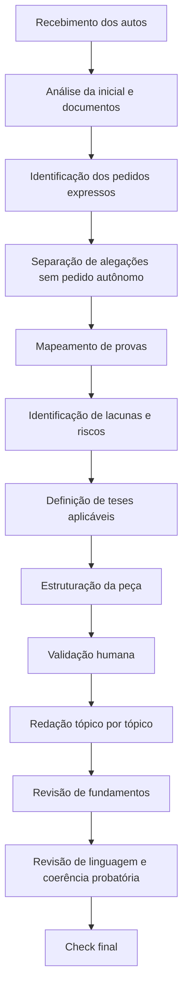

# A|DVOGADA — Legal AI aplicada ao Contencioso

Projeto autoral de **IA aplicada ao Direito, Legal Operations e automação jurídica**, desenvolvido para apoiar rotinas de contencioso trabalhista, previdenciário e administrativo.

A A|DVOGADA atua como agente jurídico especializado em **análise processual, identificação de pedidos, mapeamento probatório, estruturação de teses, impugnação documental, organização de conhecimento jurídico e apoio à redação de peças processuais**.

O projeto combina experiência jurídica prática, engenharia de prompts, governança de IA generativa, análise documental e padronização de fluxos jurídicos.

---

## Problema

Rotinas jurídicas envolvem grande volume de documentos, prazos, teses, provas, fundamentos, decisões estratégicas e informações dispersas.

Em contencioso, parte relevante do risco está na ausência de organização entre:

- fatos alegados;
- pedidos expressos;
- documentos disponíveis;
- provas efetivamente produzidas;
- lacunas probatórias;
- fundamentos legais;
- jurisprudências aplicáveis;
- riscos processuais;
- linguagem adequada da peça.

Quando essas informações ficam dispersas entre autos, modelos, planilhas, anotações internas e documentos soltos, há aumento de retrabalho, inconsistências argumentativas e perda de eficiência na gestão do conhecimento jurídico.

---

## Solução proposta

A A|DVOGADA estrutura um fluxo jurídico assistido por IA, com curadoria humana especializada, para apoiar a rotina contenciosa.

O projeto busca organizar:

- análise integral dos autos;
- identificação de pedidos expressos;
- separação entre pedidos e alegações sem pedido autônomo;
- mapeamento de documentos e provas;
- identificação de fatos incontroversos e controvertidos;
- identificação de lacunas probatórias;
- construção de teses jurídicas;
- impugnação documental;
- análise de mídias digitais;
- padronização de modelos e checklists;
- revisão de fundamentos legais e jurisprudenciais;
- apoio à redação estratégica de peças processuais;
- gestão do conhecimento jurídico.

A proposta não é substituir o raciocínio jurídico humano, mas apoiar etapas repetitivas, analíticas e documentais com método, rastreabilidade e curadoria técnica.

---

## Evolução do Projeto

| Versão inicial | Versão aprimorada |
|---|---|
| Projeto apresentado como IA aplicada ao Direito e Legal Ops. | Projeto posicionado como agente jurídico especializado em contencioso trabalhista, previdenciário e administrativo. |
| Foco em análise processual, revisão estratégica e organização de teses. | Fluxo completo com análise de autos, identificação de pedidos, mapa de provas, teses, lacunas, riscos, estrutura e redação assistida. |
| Funcionalidades descritas como em desenvolvimento. | Funcionalidades organizadas como módulos operacionais do agente jurídico. |
| Organização de prompts e conhecimento jurídico. | Governança de IA com travas contra alucinação jurídica, controle de artigos, jurisprudências e fatos sem prova. |
| Apoio à revisão de peças processuais. | Redação tópico por tópico, condicionada à validação prévia da estrutura e das teses. |
| Checklist de documentos e inconsistências. | Checklist jurídico completo: pedidos, provas, documentos, mídias, fundamentos, riscos, linguagem e coerência final. |
| Análise documental geral. | Impugnação documental individualizada com análise de ID, autenticidade, integralidade, contexto, metadados, origem e força probatória. |
| Uso responsável de IA como diretriz geral. | Uso responsável transformado em regra operacional: IA como apoio, sem substituir análise jurídica humana, com revisão técnica obrigatória. |

---

## Funcionalidades

- Análise inicial de casos jurídicos.
- Leitura e organização de autos processuais.
- Extração de pontos relevantes de documentos.
- Identificação de pedidos expressos.
- Separação entre pedidos, alegações e contexto fático.
- Mapeamento de fatos, provas, lacunas e riscos.
- Organização de argumentos e teses jurídicas.
- Estruturação de peças processuais.
- Apoio à redação de contestações, recursos e manifestações.
- Impugnação individualizada de documentos.
- Análise de prints, áudios e vídeos.
- Padronização de modelos e checklists.
- Organização de conhecimento jurídico.
- Revisão de linguagem jurídica.
- Revisão de artigos legais e jurisprudências.
- Checklist final de qualidade.

---

## Fluxo operacional

## Observação

Este repositório não contém dados reais de clientes, processos ou documentos sigilosos.

Todos os exemplos utilizados devem ser fictícios, públicos ou anonimizados.

## Autora

Brunna Leite Felix
LinkedIn: https://linkedin.com/in/brunnalfelix
GitHub: https://github.com/khaosfelix
